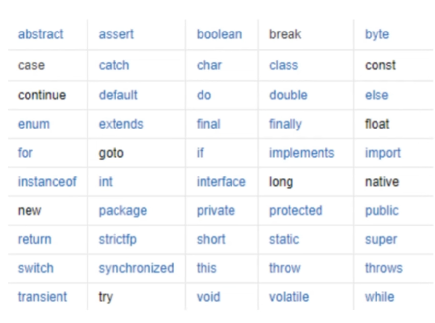

## 01 注释

```Java
public class Hello {
    public static void main(String[] args) {
        System.out.println("Hello, World!");
    }
}
```

```Java
public class Main {
    public static void main(String[] args) {
        // 单行注释
        System.out.println("Hello world!");
        /*
        多行注释
         */

        // JavaDoc:文档注释 /** */
        /**
         * @Description Hello word
         * @Author Snofly
         */

    }
}
```

## 02 标识符和关键字



## 03 数据类型

强类型语言：要求变量的使用严格符合规定，所有变量都必须先定义后才能使用。

弱类型语言：数据类型可以不固定。

- 基本数据类型(8 种)
  - 数值类型
    - 整数类型
      - byte 占 1 字节 范围 -128~127
      - short 占 2 字节 范围 -32768~32767
      - int 占 4 字节 范围 -2147483648~2147483647
      - long 占 8 字节 范围 -9223372036854775808~9223372036854775807
    - 浮点类型
      - float 占 4 字节
      - double 占 8 字节
    - 字符类型 char 占 2 字节
  - boolean 类型 占 1 位，只有 true 和 false 两个值
- 引用数据类型
  - 类
  - 接口
  - 数组

计算机单位：
位 bit：位，计算机中最小的单位。
字节 byte：字节，计算机中基本存储单元。1B = 8bit
字符：是指计算机中使用的字母、数字、字和符号。

1024B = 1KB
1024KB = 1M
1024M = 1G

## 04 数据类型拓展及面试题

- 进制
  - 二进制 0b
  - 八进制 0
  - 十进制
  - 十六进制 0x
- 浮点数：有限、离散、大约、接近但不等于
- 字符编码
- 转义字符
- 对象定义 从内存分析

## 05 类型转换

- 低 --------------------------------------------------------------------------------------------> 高

  - byte, short, char -> int -> long -> float -> double

- 强制转换 高 -> 低

  - 格式：(类型)变量名 高 -> 低
  - 注意点：
    - 不能对布尔值进行转换
    - 不能把对象类型转换为不相干的类型
    - 在把高容量转换到低容量的时候，强制转换
    - 转换的时候可能存在内存溢出，或者精度问题！

- 自动转换 低 -> 高
  - 注意点：
    - 不能对布尔值进行转换
    - 不能把对象类型转换为不相干的类型
    - 在把高容量转换到低容量的时候，强制转换
    - 转换的时候可能存在内存溢出，或者精度问题！
