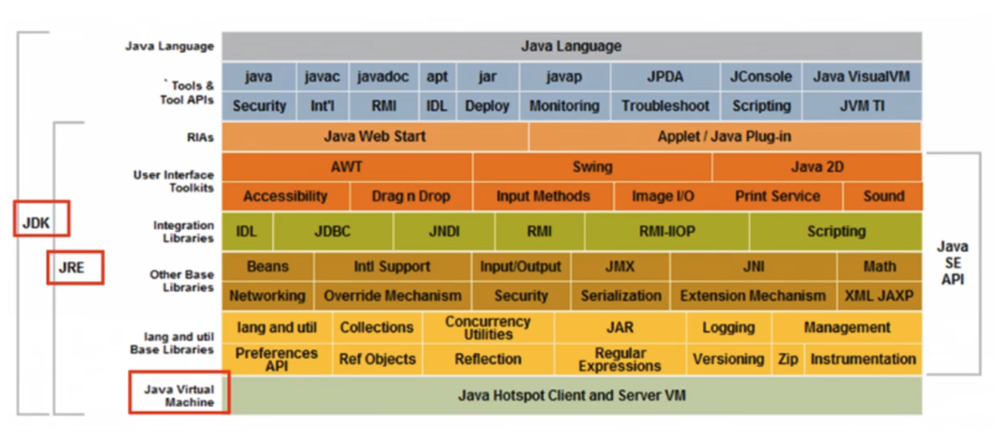

## 02 Java 特性与优势

- 简单性
- 面向对象
- 可移植性
- 高性能
- 分布式
- 动态性
- 多线程
- 安全性
- 健壮性

## 03 Java 三大版本

- JavaSE（Java Standard Edition）标准版 —— 桌面程序、控制台开发
- JavaME（Java Micro Edition）小型版 —— 手机、小家电
- JavaEE（Java Enterprise Edition）企业版 —— Web 端、服务器开发

## 04 JDK 、JRE 、JVM

- JDK：Java Development Kit ，Java 开发工具包，提供了 Java 的开发环境和运行环境。
- JRE：Java Runtime Environment ，Java 运行环境，为 Java 的运行提供了所需环境。
- JVM：Java Virtual Machine ，Java 虚拟机，运行 Java 字节码的虚拟机。



## 05 安装

略。

## 06 hello world

```Java
public class Hello {
    public static void main(String[] args) {
        System.out.println("Hello, World!");
    }
}
```
