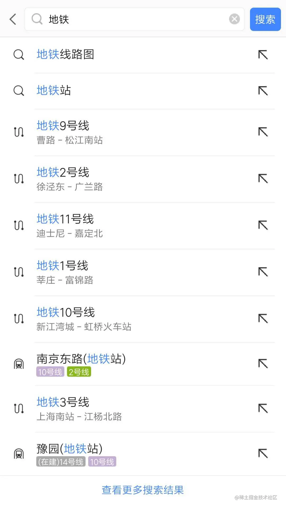

## 81 打印出 1 - 10000 之间的所有对称数，例如：121、1331 等

81.js

## 82 周一算法题之「移动零」

```
给定一个数组 nums，编写一个函数将所有 0 移动到数组的末尾，同时保持非零元素的相对顺序。

示例:

输入: [0,1,0,3,12]
输出: [1,3,12,0,0]

说明:

1、必须在原数组上操作，不能拷贝额外的数组。

2、尽量减少操作次数。
```

82.js

## 83.js var、let 和 const 区别的实现原理是什么

它们的行为差异源于 JavaScript 引擎在编译和执行时对它们的处理方式不同

编译阶段，JavaScript 会根据作用域创建“环境记录（Environment Record）”

对于 var，变量绑定存在于其所属的函数环境记录中（Function Environment Record）。

对于 let 和 const，它们绑定在块级环境记录（Block Environment Record）中，并且每次进入新块都会新建一个环境记录。

所有声明都会被“预处理”——编译阶段进入词法环境（Lexical Environment）。

var 的声明会被提升，并立即初始化为 undefined 。

let 和 const 也会被记录，但不会被初始化，处于“暂时性死区（Temporal Dead Zone, TDZ）”，直到执行到声明语句。

## 84 请实现一个 add 函数，满足以下功能。

```js
add(1); // 1
add(1)(2); // 3
add(1)(2)(3); // 6
add(1)(2, 3); // 6
add(1, 2)(3); // 6
add(1, 2, 3); // 6
```

84.js

## 85 react-router 里的 Link 标签和 a 标签有什么区别？如何禁掉 a 标签默认事件，禁掉之后如何实现跳转？

| 特性           | `<Link>`（来自 react-router）                                     | `<a>`（原生 HTML）       |
| -------------- | ----------------------------------------------------------------- | ------------------------ |
| **跳转方式**   | 使用 `history.push` 改变 URL，不刷新页面（**单页应用 SPA 体验**） | 默认会导致页面刷新       |
| **性能**       | 更快、保留页面状态                                                | 刷新页面，重新加载资源   |
| **作用**       | 仅改变前端路由，不重新请求 HTML 文档                              | 发起 HTTP 请求，刷新页面 |
| **支持 props** | 支持 `to=""`、`replace`、`state` 等 props                         | 仅支持 `href`            |

```html
<!-- 禁用 a 标签的默认行为 -->
<a href="/about" onClick={(e) => e.preventDefault()}>
  About
</a>
```

```js
// 你可以手动使用 react-router-dom 提供的 useNavigate 或 useHistory 来编程式跳转
import { useNavigate } from "react-router-dom";

function MyLink() {
  const navigate = useNavigate();

  const handleClick = (e) => {
    e.preventDefault(); // 阻止默认跳转
    navigate("/about"); // 手动跳转
  };

  return (
    <a href="/about" onClick={handleClick}>
      About
    </a>
  );
}
```

```
从最终渲染的 DOM 来看，这两者都是链接，都是 <a> 标签，区别是：

<Link> 是 react-router 里实现路由跳转的链接，一般配合 <Route> 使用，react-router 接管了其默认的链接跳转行为，区别于传统的页面跳转，<Link> 的“跳转”行为只会触发相匹配的 <Route> 对应的页面内容更新，而不会刷新整个页面。

<a> 标签就是普通的超链接了，用于从当前页面跳转到 href 指向的另一个页面（非锚点情况）。
```

## 86 周一算法题之「两数之和」

给定一个整数数组和一个目标值，找出数组中和为目标值的两个数。

你可以假设每个输入只对应一种答案，且同样的元素不能被重复利用。

示例：

```
给定 nums = [2, 7, 11, 15], target = 9

因为 nums[0] + nums[1] = 2 + 7 = 9
所以返回 [0, 1]
```

86.js

## 87 在输入框中如何判断输入的是一个正确的网址？

```js
function isValidURL(url) {
  const pattern =
    /^(https?:\/\/)?([\w-]+\.)+[\w-]+(\/[\w\-._~:/?#[\]@!$&'()*+,;=]*)?$/i;
  return pattern.test(url);
}
```

```js
function isValidURL(url) {
  try {
    new URL(url.includes("://") ? url : "http://" + url);
    return true;
  } catch (_) {
    return false;
  }
}
```

```js
async function urlIsReachable(url) {
  try {
    const response = await fetch(url, { method: "HEAD" });
    return response.ok;
  } catch {
    return false;
  }
}
```

## 88 实现 convert 方法，把原始 list 转换成树形结构，要求尽可能降低时间复杂度

88.js

## 89 设计并实现 Promise.race()

89.js

## 90 实现模糊搜索结果的关键词高亮显示

90.html



## 91 介绍下 HTTPS 中间人攻击

https 协议由 http + ssl 协议构成，具体的链接过程可参考 [SSL 或 TLS 握手的概述](https://github.com/lvwxx/blog/issues/3)

中间人攻击过程如下：

- 1、服务器向客户端发送公钥。
- 2、攻击者截获公钥，保留在自己手上。
- 3、攻击者自己生成一个【伪造的】公钥，发给客户端。
- 4、客户端收到伪造的公钥后，生成加密 hash 值发给服务器。
- 5、攻击者获得加密 hash 值，用自己的私钥解密获得真秘钥。
- 6、同时生成假的加密 hash 值，发给服务器。
- 7、服务器用私钥解密获得假秘钥。
- 8、服务器用加秘钥加密传输信息

防范方法：

- 1、服务端在发送浏览器的公钥中加入 CA 证书，浏览器可以验证 CA 证书的有效性

> https 不存在中间人攻击。除非你自己忽略浏览器的不安全提醒，或者自己 http client 禁用证书校验。但是这都是使用者的错，和 https 没有关系。
> https 本就有 CA 认证过程，这个就是用来防止劫持，退一万步讲，就算你伪造 CA 成功，你也拿不到我的对称密钥，除非客户端主动泄漏，我实在不理解 HTTPS 如何能进行中间人攻击。我觉得这个问题应该改成 http 的中间人攻击？

## 92 已知数据格式，实现一个函数 fn 找出链条中所有的父级 id

92.js

## 93 给定两个大小为 m 和 n 的有序数组 nums1 和 nums2。请找出这两个有序数组的中位数。要求算法的时间复杂度为 O(log(m+n))。

93.js

## 94 vue 在 v-for 时给每项元素绑定事件需要用事件代理吗？为什么？

在 Vue 中使用 v-for 渲染列表时，并不一定需要使用事件代理。Vue 本身支持为每个列表项单独绑定事件处理函数，而且它在内部做了性能优化，所以一般情况下，你可以直接给每个元素绑定事件处理函数而不用担心性能问题。

```html
<template>
  <ul>
    <li v-for="(item, index) in list" :key="index" @click="handleClick(item)">
      {{ item }}
    </li>
  </ul>
</template>

<script>
  export default {
    data() {
      return {
        list: ["Apple", "Banana", "Cherry"],
      };
    },
    methods: {
      handleClick(item) {
        console.log("Clicked:", item);
      },
    },
  };
</script>
```

这种方式在 Vue 内部会通过虚拟 DOM 的差分机制，只为必要的 DOM 节点绑定事件处理器。对于绝大多数应用场景来说，它的性能已经足够好。

当列表非常大或存在频繁 DOM 更新时，可考虑事件代理。
