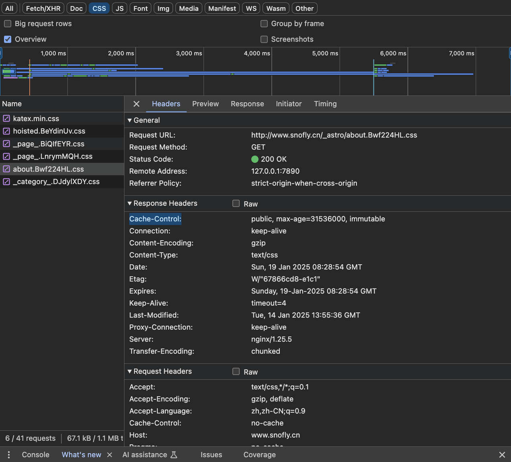

### 响应头设置

设置永久缓存：

```
Cache-Control: public,max-age=31536000,immutable
```

在 nginx 中设置：（我用的这个，其他没测试）

```nginx
http {
  # other config
  # ...
  server {
    # other config
    # ...

    # 针对静态资源添加缓存策略
    location ~* \.(jpg|jpeg|png|gif|ico|css|js|woff2|woff|ttf|svg|eot)$ {
        root   $YOUR_DIST_PATH; # 静态资源的根目录
        add_header Cache-Control "public, max-age=31536000, immutable"; # 缓存一年
        add_header Expires $date_gmt; # 动态生成过期时间
    }
  }
}
```

### nginx 重启

```bash
# 检查配置语法是否正确：
nginx -t
# 如果正确，重新加载配置：
nginx -s reload
# restart
sudo systemctl restart nginx
# check status
sudo systemctl status nginx
```

### 验证成功



### 其他：webpack chunkId

在 webpack 中，通过 optimization.chunkIds 可设置确定的 chunId，来增强 Long Term Cache 能力。

```
{
  optimization: {
    chunkIds: 'deterministic'
  }
}
```
